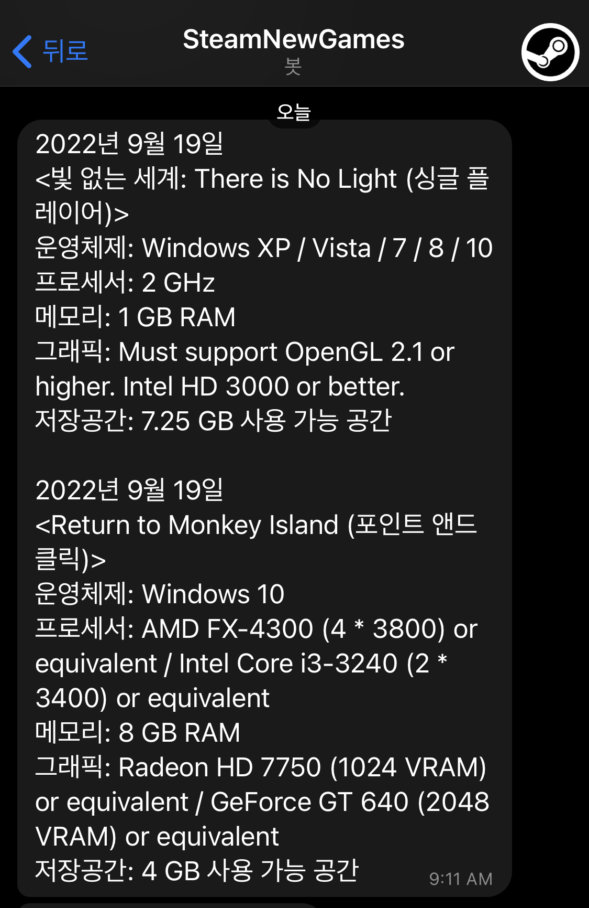
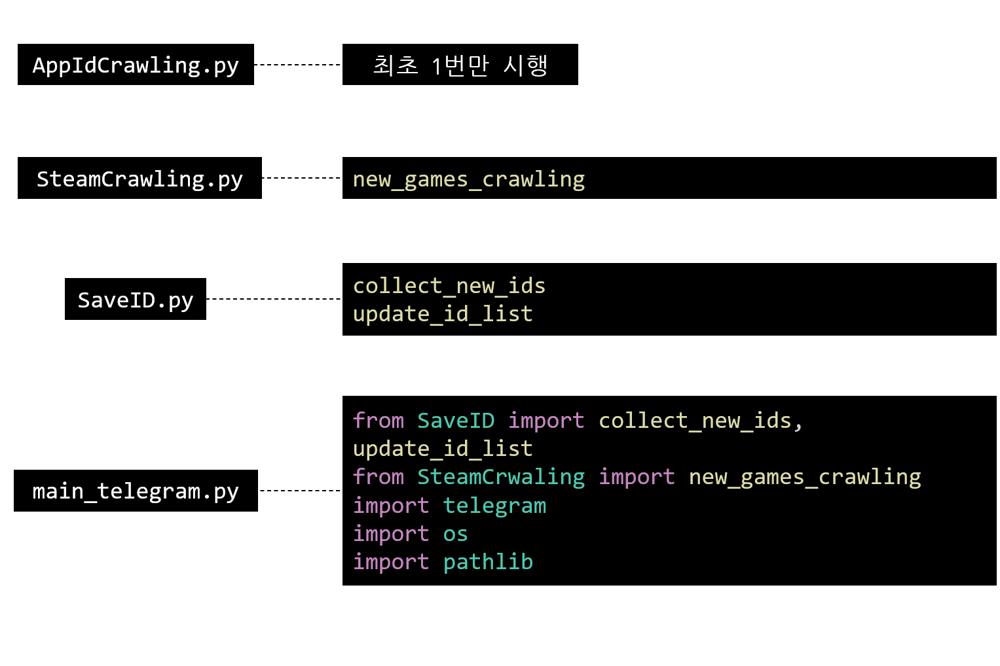

<h2 align="center">📚 Tech Stack 📚</h2>
<p align="center">
  </a>&nbsp
   
</p>

#

<h2 align="center"> More Details 🌱</h2>
<p align ="center">
  <a href="https://velog.io/@seulki971227/series/%ED%8C%8C%EC%9D%B4%EC%8D%AC%ED%81%AC%EB%A1%A4%EB%A7%81"></a>&nbsp
</p>

#

# 프로젝트 소개
스팀 홈페이지 신작과 신작의 시스템요구사항 정보를 하루에 한번 전송해주는 텔레그램 봇 만들기   


# 프로젝트 진행 과정
1. `requests`와 `BeautifulSoup`을 이용해 스팀 홈페이지 "신규제품"탭 크롤링
2. 제품의 `id_list`를 만들어 정기적으로 크롤링 할 시, 기존에 있던 제품 id는 신규 제품이 아니라고 판단하고, 새롭게 저장된 id를 신규제품으로 판단해 해당 id의 게임의 정보를 저장
3. 저장한 정보를 텔레그램으로 정기적으로 전송

# 모듈 상세 설명

- `AppIdCrawling.py`
: 기존의 게임 목록 수집
- `SteamCrwaling.py`
: Steam App Id를 기반으로 게임목록 크롤링, 각 게임별 시스템 요구사항을 크롤링
- `SaveID.py`
: ID List 관리
- `main_telegram.py`
: 신규 제품 정보를 전송해주는 텔레그램 봇
(cron을 통해 매일 n시에 수행하도록 함)

# 사용법
```python
# 사용할 모듈, 함수 import
from SaveID import collect_new_ids, update_id_list
from SteamCrwaling import new_games_crawling
```
- `telegram_config`파일은 `token=********` 형식으로 구성된 파일을 읽어올 수 있도록 만들어졌습니다. (본인의 텔레그램 봇 api를 사용하면 활용할 수 있습니다.)
- EC2 서버에서 `cron`으로 스케줄링을 사용하면 정해진 시간에 메시지를 보낼 수 있습니다. ([Cron 표현법, 사용방식](https://velog.io/@seulki971227/Cron-%ED%81%AC%EB%A1%A0Cron-%ED%91%9C%ED%98%84%EC%8B%9D-%EC%82%AC%EC%9A%A9%EB%B2%95), [EC2 TimeZone 변경하기 (for cron)](https://velog.io/@seulki971227/AWS-EC2-TimeZone-%EB%B3%80%EA%B2%BD%ED%95%98%EA%B8%B0-for-cron))
